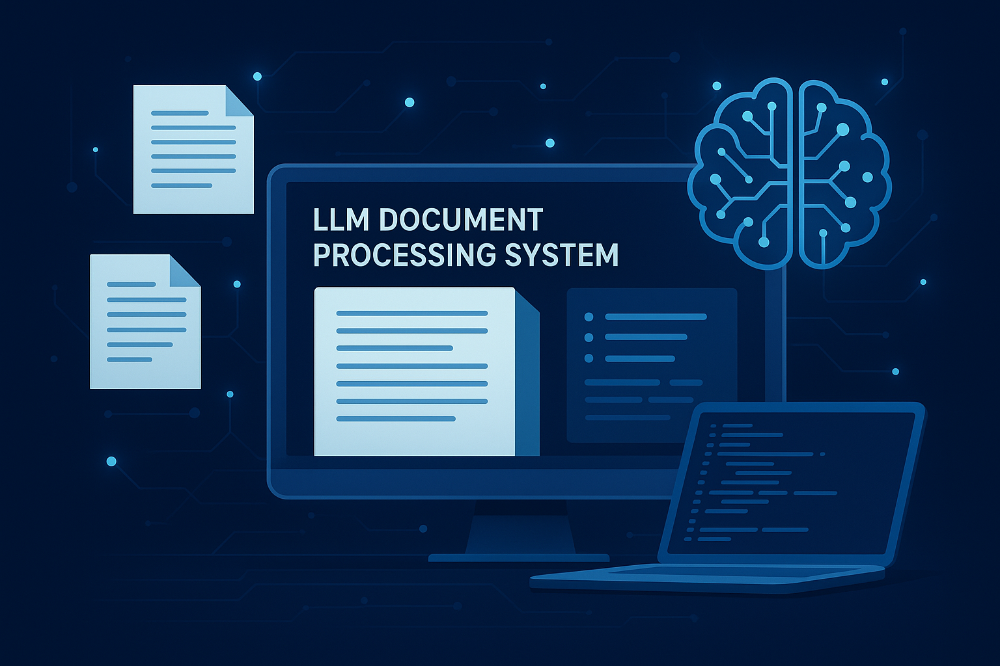

# AI-Powered Insurance Claim Assistant (RAG System)

This project is an advanced **Retrieval-Augmented Generation (RAG) system** designed to serve as an intelligent assistant for insurance claim processing. It is specifically fine-tuned to understand and answer questions based on a curated set of **five Bajaj Finance and insurance policy documents**. The system ingests and processes unstructured PDF data to provide **accurate, grounded, and verifiable responses** to user queries.

---

## 🚀 Features

- **End-to-End RAG Pipeline**: Complete workflow from document parsing and text chunking to embedding, retrieval, and LLM-based response generation.  
- **Domain-Specific Fine-Tuning**: A `Qwen1.5-7B-Chat` model fine-tuned using a custom dataset of 130-150 queries for insurance domain knowledge.  
- **Vector Search & Reranking**: Uses `BAAI/bge-large-en-v1.5` for semantic embeddings and a fine-tuned cross-encoder reranker for relevant document retrieval.  
- **Performance & Accuracy**: Achieves **~87% accuracy** on a custom evaluation dataset.  
- **Structured JSON Output**: LLM outputs are strictly in machine-readable JSON format including decisions, justifications, and policy clause citations.  

---

## 🛠️ Tech Stack

- **Core Libraries**: Python, PyTorch, Hugging Face Transformers  
- **Vector Database**: FAISS  
- **LLM**: Qwen/Qwen1.5-7B-Chat (fine-tuned with LoRA)  
- **Embedding Model**: BAAI/bge-large-en-v1.5  
- **Reranker Model**: `cross-encoder/ms-marco-MiniLM-L-6-v2` (fine-tuned with LoRA)  
- **Document Parsing**: PyMuPDF (fitz)  
- **Text Processing**: langchain_text_splitters  

---

## 📂 Project Structure

